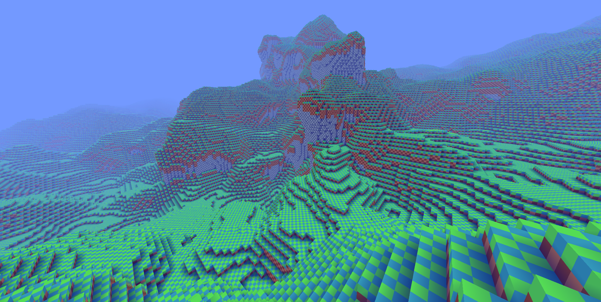

<p align="center">

</p>

## Project Overview

> WARNING: This project is mainly an quick experiment and lacks a lot of support for specific areas, such as Asset loading.

### Description

This is an unnamed voxel engine project. It is made with `C++`, albeit rather `C` styled, through `CMake` and uses [`GLFW`](https://github.com/glfw/glfw) with [`GLEW`](https://github.com/nigels-com/glew) for graphical rendering.

The primary use case for this project is experimentation and for potential use in game jams.

### Architecture

```
└── binaries
	└── build* (Holds the output binaries for the target platform)
└── modules
	└── ...
	└── JLib (Custom library with simple helpers & libraries)
└── source
    └── Assets (Will be moved or compiled into the final target binary file or folder)
	└── Entities
	└── Engine (The underlying simple game engine)
```

### Compiling

The project will be compiled and released using `MinGW GCC 8.1.0` and may not support other compilers or versions. This may happen in the future but there are no intentions yet, mainly due to the experimental nature of the project.

## Gallery

